# Lab 2 - Command Line

## ```hostname```
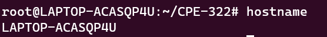

## ```env```
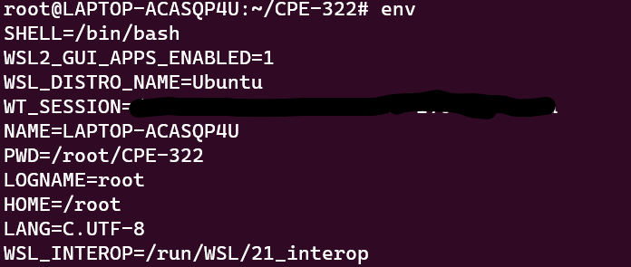
etc...

## ```ps```
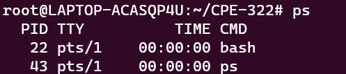

## ```pwd```
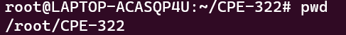

## ```git clone```
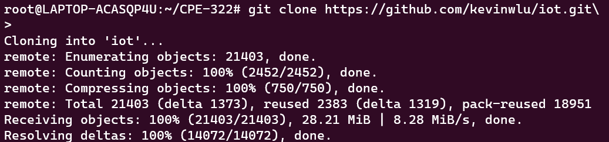

## ```cd iot```
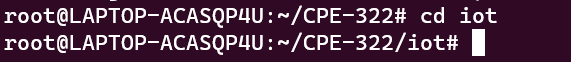

## ```ls```
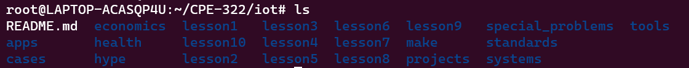

## ```cd```
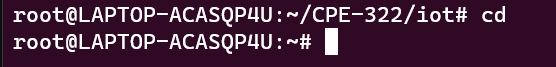

## ```df```
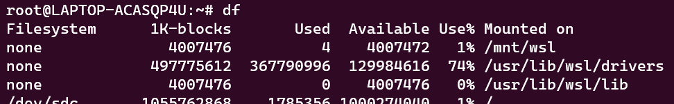
etc...

## ```mkdir```
Makes new directory\
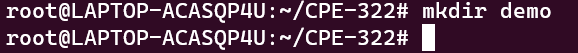

## ```cd demo```
Enters new demo directory

## ```nano file```
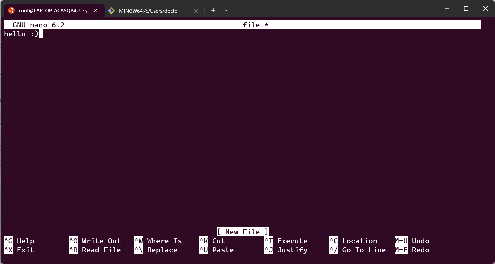

## ```cat file```
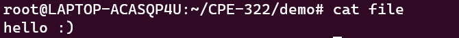

## ```cp file file1```
Copies `file` to `file1`\
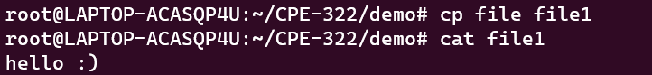

## ```mv file file2```
Moves `file` to `file2`, effectively chaning the name of `file` to `file2`\
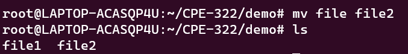

## ```rm file2```
Removes file2\
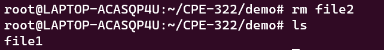

## ```clear```
Clears terminal history\
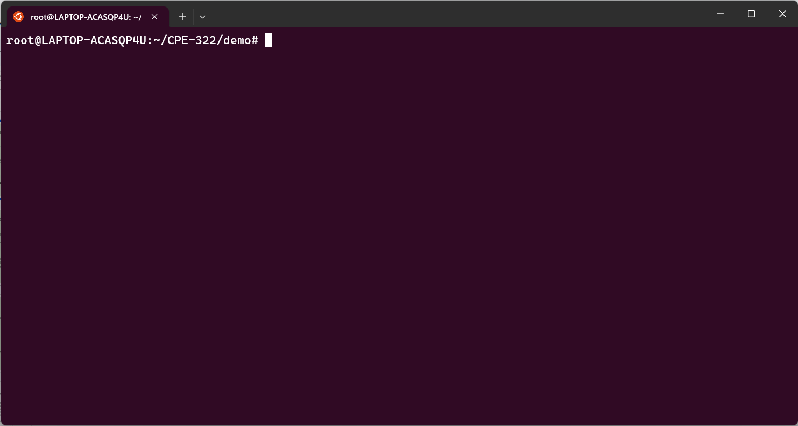

## ```man uname```
Opens up manual page for the uname comand\
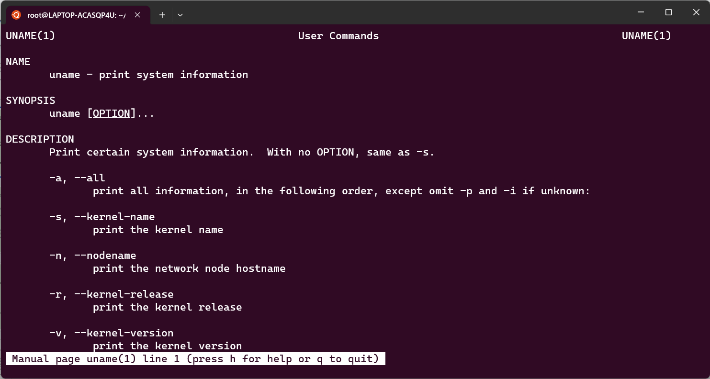

## ```uname```
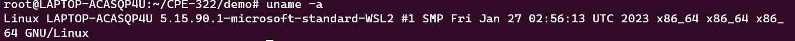

## ```ifconfig```
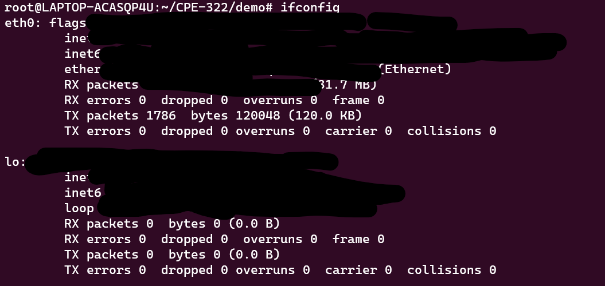

## ```ping localhost```
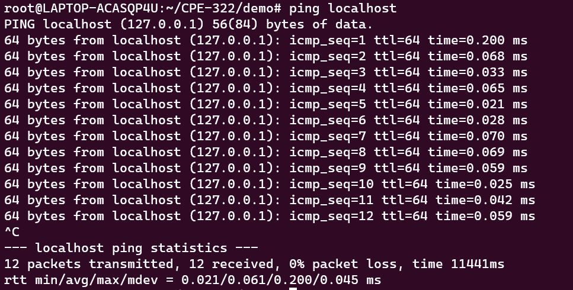

## ```netstat```
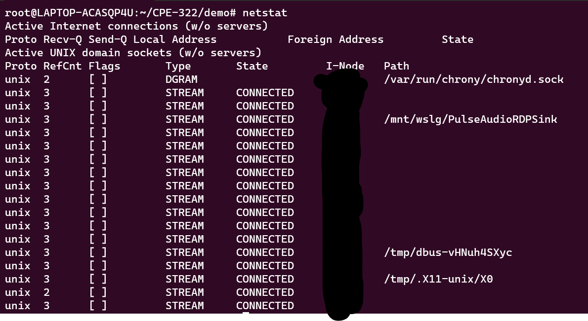