# Lab 3 - Python

## Package Installs

### ```jdcal```
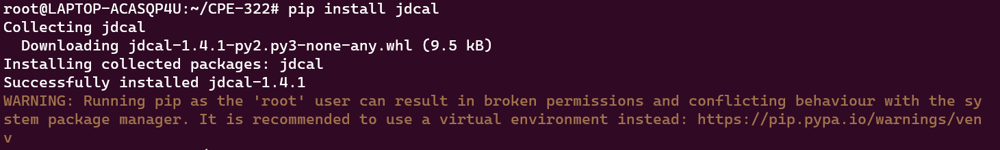

### ```astral```
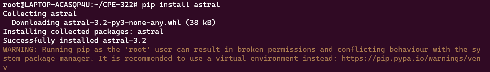

### ```geopy```
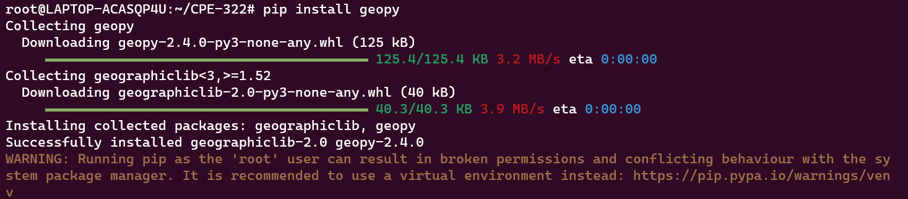

### ```pytz```
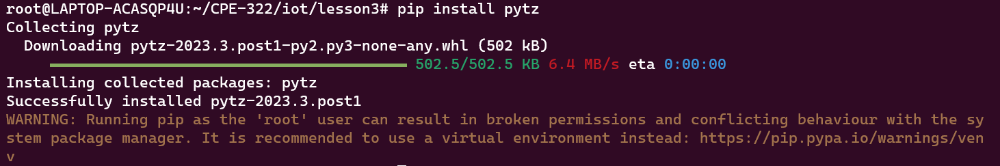

### ```psutil```
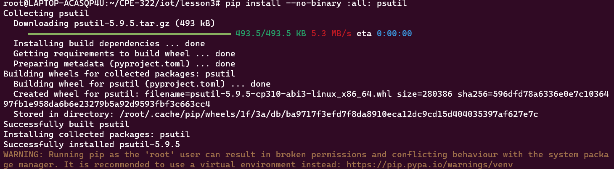

## Running Python Program Examples

### ```julian.py```
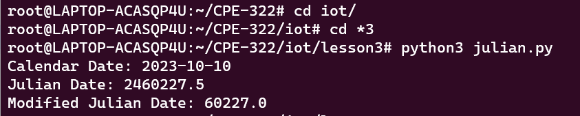

### ```date_example.py```
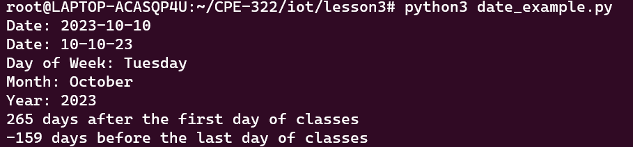

### ```datetime_example.py```
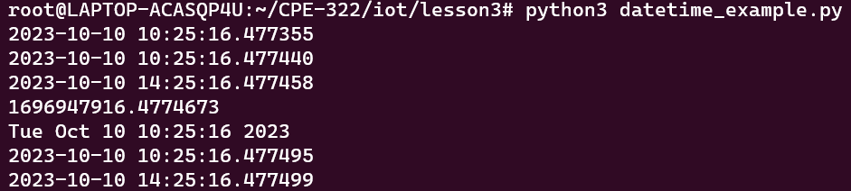

### ```time_example.py```
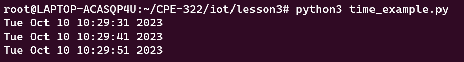

### ```sun.py 'New York' ```
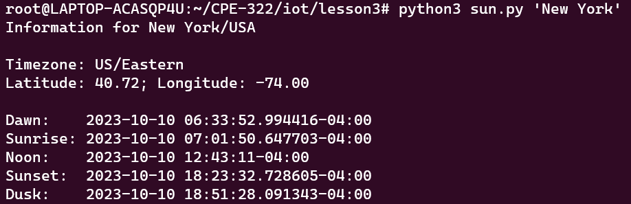

### ```moon.py```
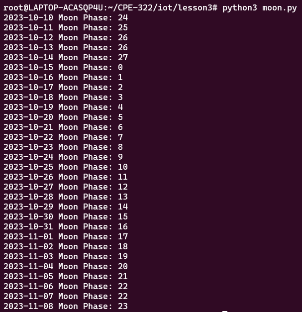

### ```coordinates.py 'SC Williams Library'```
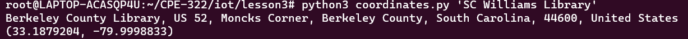

### ```address.py '40.74480675, -74.02532862031404'```
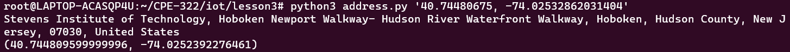

### ```cpu.py```
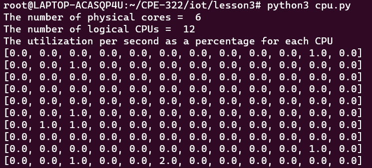

### ```battery.py```
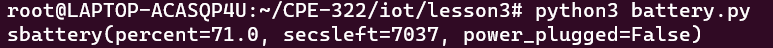

### ```documentstats.py document.txt```
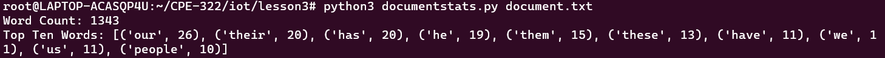