# Lab 4 - Django and Flask
## Setting up and running ```stevens``` Django Project
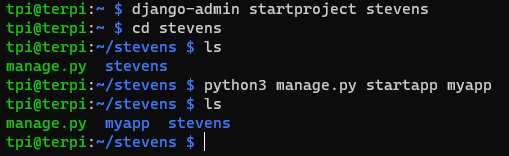
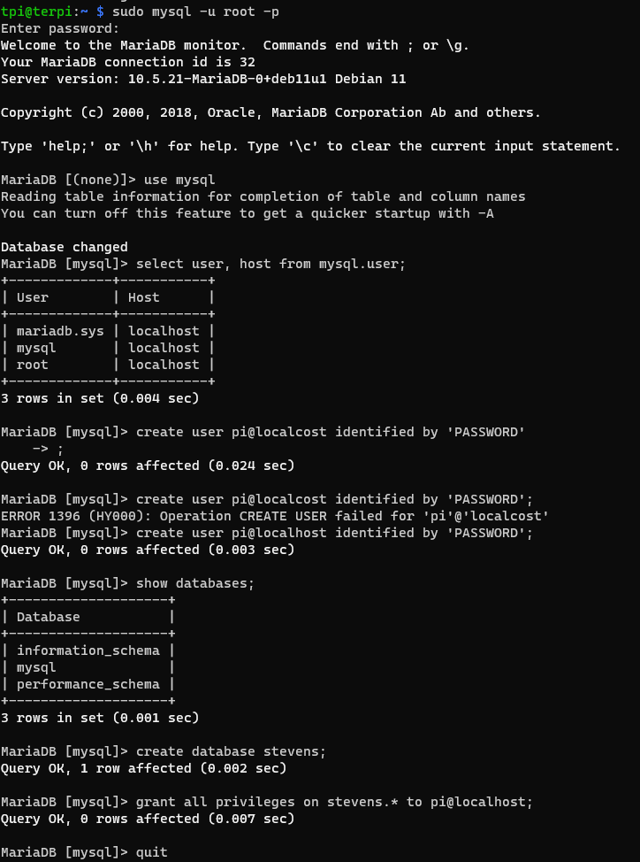
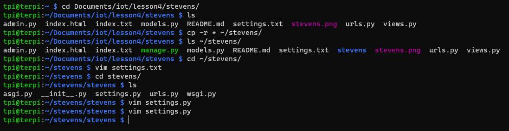
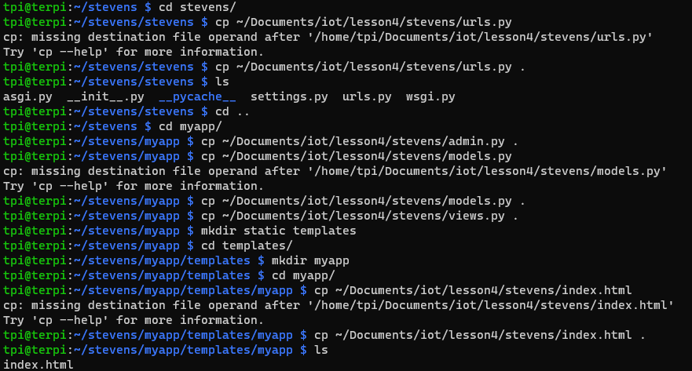
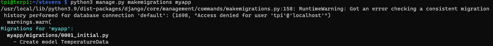
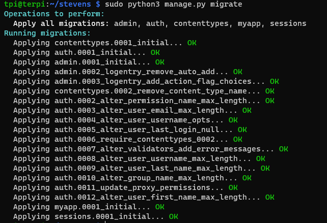
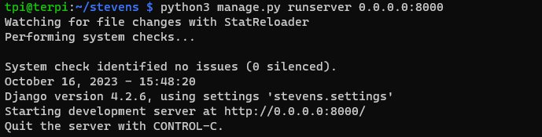
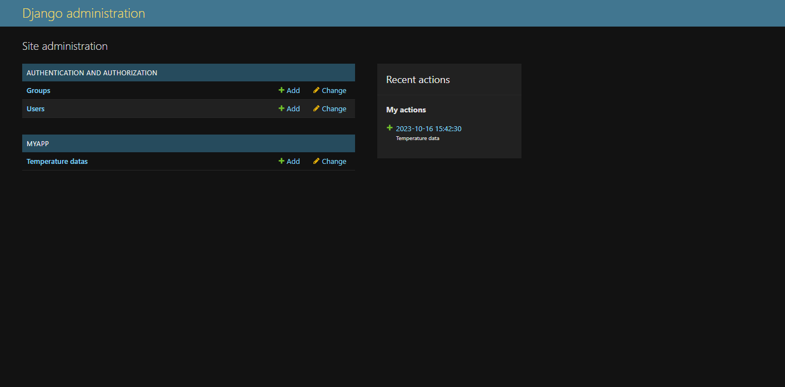
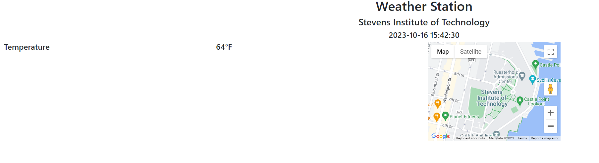

## Setting up and running ```mycpu``` Django REST Project
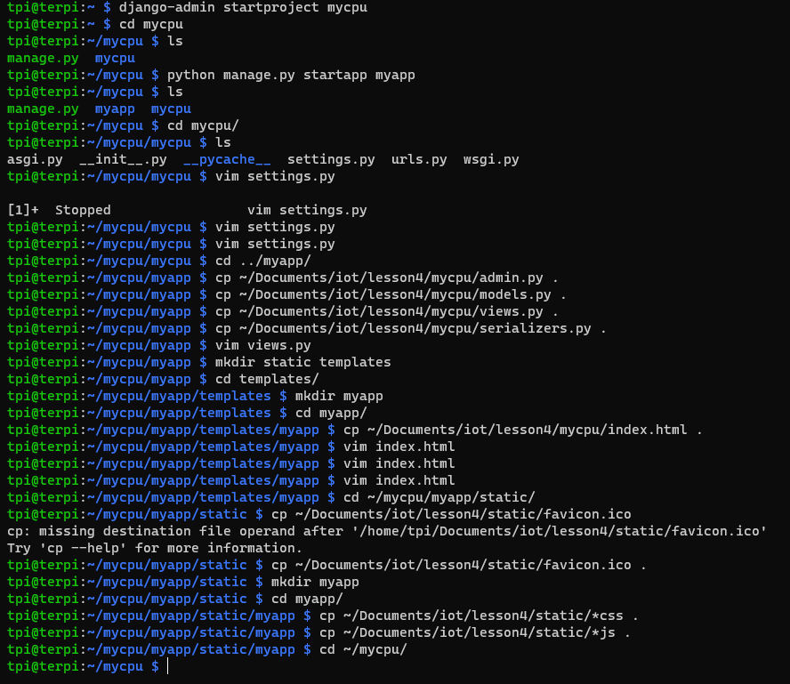
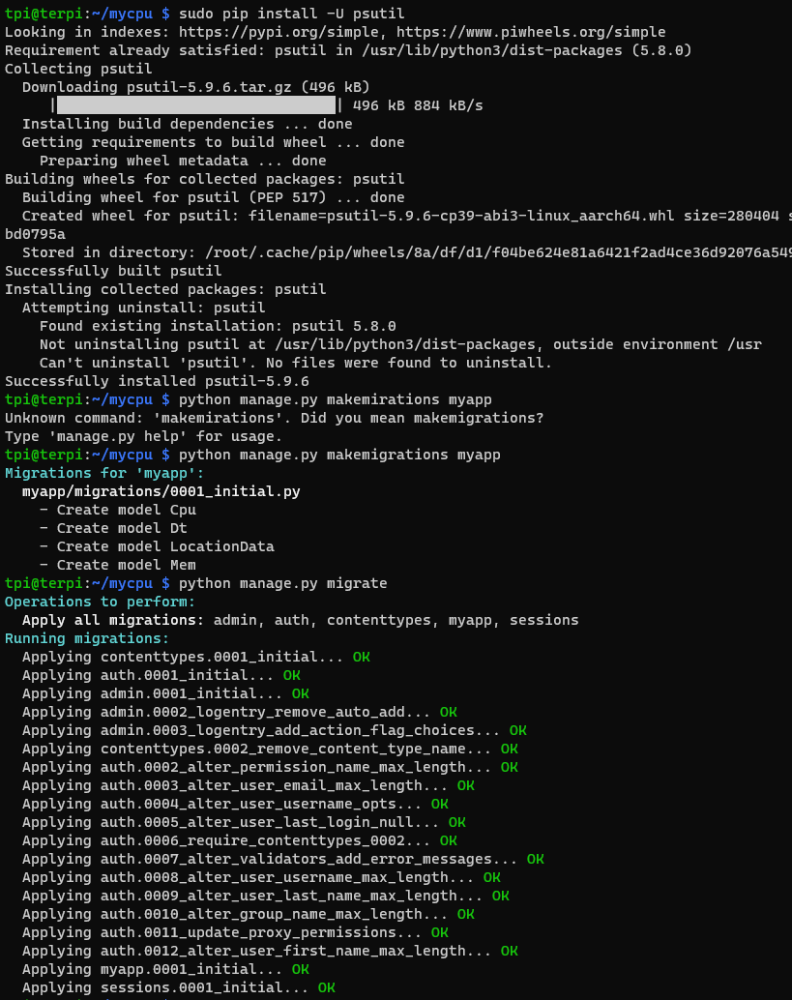
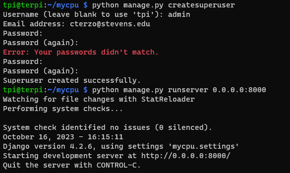
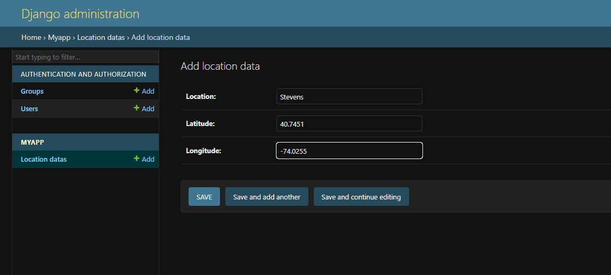
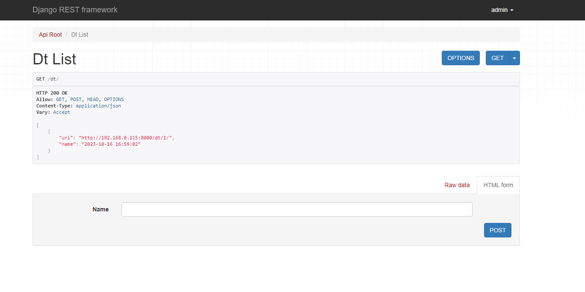
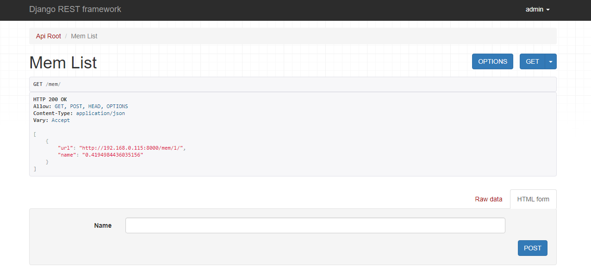
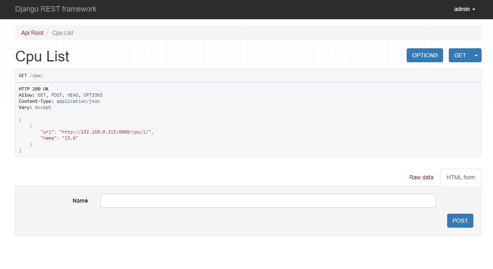
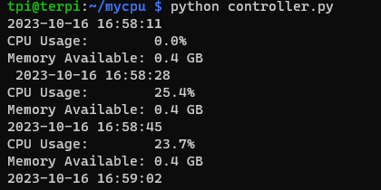
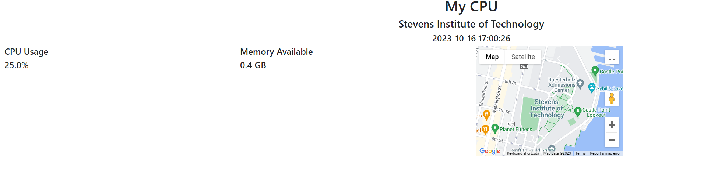

## Setting up and running ```hello_world.py``` flask project
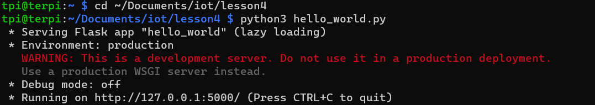
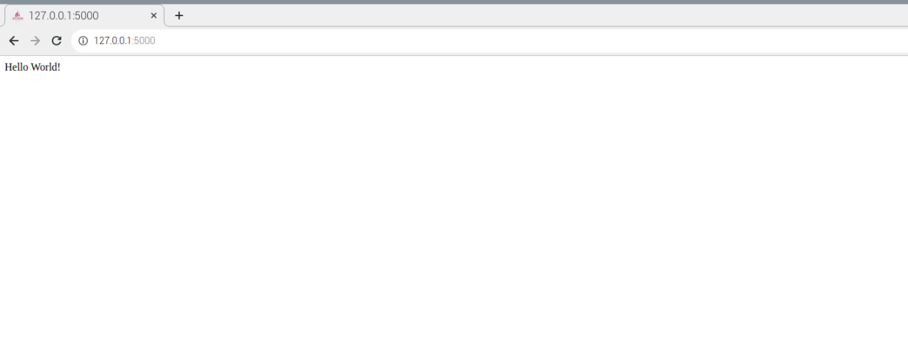
